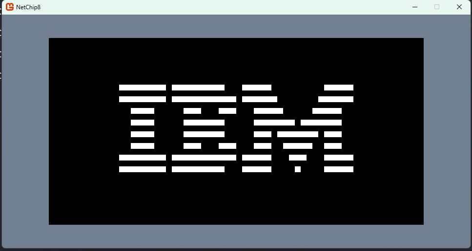

# NetChip8 

*aka Enterprise Chip-8* 

CHIP-8 emulator implemented in C# / dotnet + MonoGame, with added completely unnecessary complexity. 

## Project Structure 

- NetChip8.DesktopGL -> MonoGame Interface 
- NetChip8.EmulatorCore -> CHIP-8 Emulator

## Current Status: 

It can run the IBM logo ROM 

---

Made with ~~🧡~~🧠 using Rider, Visual Studio and ReSharper *(because after 15+ years of writing C# I still can't decide which IDE I like)*